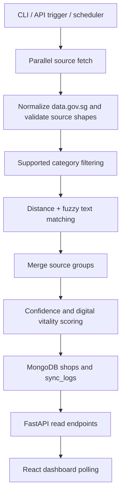
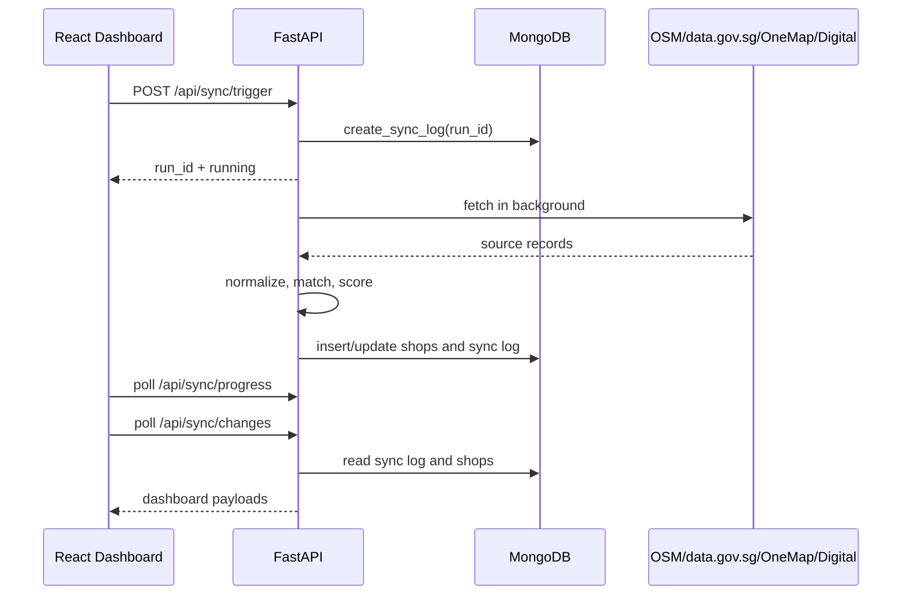

# Architecture

GeoShop Engine is organized around a deterministic geospatial intelligence pipeline:



## Runtime Components

| Component | Files | Responsibility |
| --- | --- | --- |
| CLI pipeline | `main.py` | Manual/demo pipeline execution. |
| API service | `api/main.py`, `run_api.py` | HTTP API, background sync triggers, health checks, dashboard support. |
| Fetchers | `data_fetchers/*.py` | Source-specific API access and raw record parsing. |
| Processors | `processors/*.py` | Category filtering, normalization, matching, merging. |
| Signal engine | `signal_engine/*.py` | Confidence and active/closed decision signals. |
| Persistence | `db/database.py`, `db/crud.py`, `db/models.py` | MongoDB connection, indexes, Pydantic document models, CRUD. |
| Dashboard | `frontend/src/*` | Operations UI with sync, trend, map, and change feed panels. |

## Request Flow



## Backend Architecture

The backend is a single FastAPI process. It owns HTTP routes and also runs ingestion work through `BackgroundTasks`. During a sync, `SYNC_PROGRESS` in `api/main.py` is mutated in memory and read by `/api/sync/progress`.

This is simple and useful for local demos, but it has production tradeoffs:

- progress disappears on restart;
- progress is not shared across multiple API instances;
- long-running ingestion work competes with API request handling;
- failed process state can leave a sync log marked `running`.

Production architecture should split API and worker responsibilities.

## Frontend Architecture

The dashboard is a client-rendered React app. `App.jsx` coordinates state and uses `Promise.all` to fetch stats, sync status, progress, history, and shops. It then chooses an active or latest successful run to load change details.

Dashboard sections:

- `SyncSection.jsx`: source counts, live progress, recent sync table.
- `TrendSection.jsx`: sync trend chart.
- `MapSection.jsx`: Leaflet map over Singapore.
- `ChangeFeedSection.jsx`: sampled change records.

## Data Model Overview

MongoDB stores flexible documents:

- `shops`: canonical merged place records and operational state.
- `sync_logs`: run-level metadata and sampled change output.

Documents are intentionally flexible because source fields and scoring metadata evolve. The tradeoff is weaker schema enforcement than a relational model.

## Matching And Scoring

Matching is deterministic:

- Records from the same source do not match each other.
- Coordinates must be within a distance threshold.
- Name/address similarity and postal-code agreement decide whether nearby records represent the same place.

Scoring is split:

- `confidence_score`: record quality based on source count, completeness, coordinates, and text quality.
- `decision_score`: blended score using 60% confidence and 40% digital vitality.

## Deployment Topology

Current implementation can run as:

```text
Browser -> static React app -> FastAPI process -> MongoDB
                                      |
                                      +-> public source APIs
```

Recommended production topology:

```text
Browser -> CDN/static host -> API gateway/reverse proxy -> FastAPI API
                                                        -> Worker process
                                                        -> MongoDB Atlas
                                                        -> Metrics/logging
```

