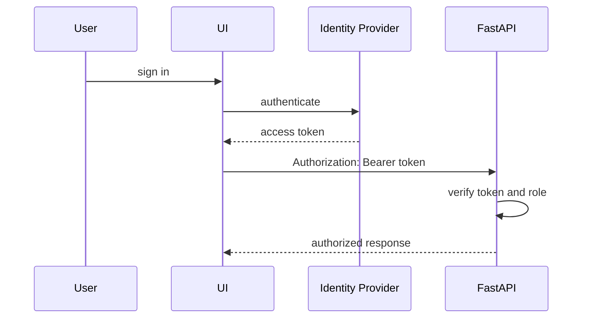

# Authentication

GeoShop Engine currently has no application-level authentication or authorization.

## Implemented Behavior

- All FastAPI routes are callable without credentials.
- CORS allows all origins:

```python
allow_origins=["*"]
allow_credentials=True
allow_methods=["*"]
allow_headers=["*"]
```

- OneMap upstream access can use `ONEMAP_ACCESS_TOKEN` or `ONEMAP_API_KEY`.
- MongoDB credentials are supplied through `MONGODB_URL`.

## Risk By Endpoint Type

| Endpoint Type | Examples | Risk |
| --- | --- | --- |
| Read-only shop endpoints | `/api/shops`, `/api/shops/stats` | Data exposure if public. |
| Operational write endpoints | `/api/sync/trigger`, `/api/update/realtime` | Expensive ingestion can be triggered by anyone. |
| Debug endpoints | `/api/debug/pipeline-data` | Can call external APIs and expose source samples. |
| Health endpoints | `/api/health/database` | Reveals database name and collection counts. |

## Recommended Production Flow



## Role Model

Recommended roles:

- `viewer`: read shops, stats, history, and changes.
- `operator`: trigger syncs and real-time updates.
- `admin`: access debug endpoints and operational configuration.

## Implementation Options

- JWT validation in FastAPI dependencies.
- API gateway authentication in front of the service.
- Internal-only deployment with VPN plus service-level API keys.

## Immediate Hardening Checklist

- Replace wildcard CORS with explicit dashboard origins.
- Require authentication on sync and debug endpoints.
- Add rate limiting to write/debug endpoints.
- Hide database details from public health responses.
- Move secrets to a secret manager in production.

