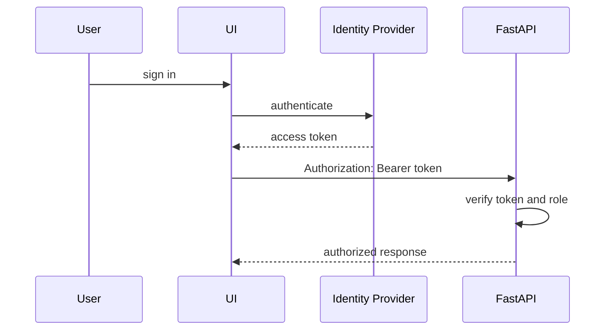

# Authentication

GeoShop Engine is structured so access control can be layered cleanly around operational endpoints as the platform evolves from local/internal workflows to shared deployments.

## Current Access Model

- FastAPI routes are optimized for local/internal operation.
- CORS is configured permissively for dashboard development:

```python
allow_origins=["*"]
allow_credentials=True
allow_methods=["*"]
allow_headers=["*"]
```

- OneMap upstream access can use `ONEMAP_ACCESS_TOKEN` or `ONEMAP_API_KEY`.
- MongoDB credentials are supplied through `MONGODB_URL`.

## Access Patterns By Endpoint Type

| Endpoint Type | Examples | Access Pattern |
| --- | --- | --- |
| Read endpoints | `/api/shops`, `/api/shops/stats` | Suitable for viewer access. |
| Operational endpoints | `/api/sync/trigger`, `/api/update/realtime` | Suitable for operator access. |
| Debug endpoints | `/api/debug/pipeline-data` | Suitable for maintainer/admin access. |
| Health endpoints | `/api/health/database` | Suitable for internal operational access. |

## Production-Oriented Access Flow



## Role Model

Suggested roles:

- `viewer`: read shops, stats, history, and changes.
- `operator`: trigger syncs and real-time updates.
- `admin`: access debug endpoints and operational configuration.

## Implementation Options

- JWT validation in FastAPI dependencies.
- API gateway authentication in front of the service.
- Internal deployment with VPN plus service-level API keys.

## Operational Hardening Path

- Replace wildcard CORS with explicit dashboard origins.
- Require authentication on sync and debug endpoints.
- Add rate limiting to write/debug endpoints.
- Hide database details from public health responses.
- Move secrets to a secret manager in production.

