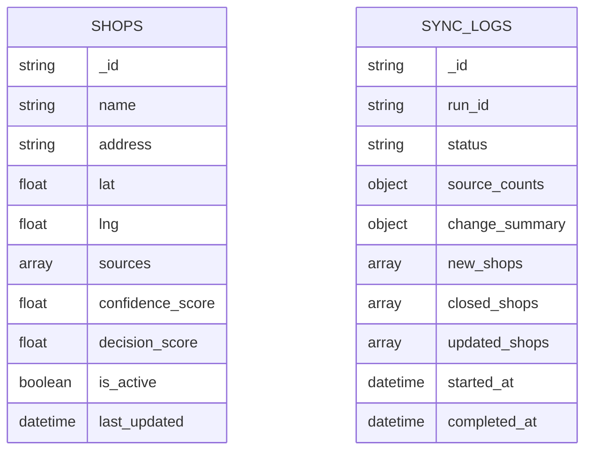

# Database Design

GeoShop Engine uses MongoDB through PyMongo. The active database implementation is in `db/database.py`, `db/crud.py`, and `db/models.py`.

## Collections

### shops

Represents a canonical place assembled from one or more source records.

Important fields:

| Field | Type | Purpose |
| --- | --- | --- |
| `_id` | string | Generated ObjectId string from Pydantic default factory. |
| `name` | string | Display/canonical place name. |
| `address` | string/null | Best available address. |
| `lat`, `lng` | float | Canonical coordinates, usually averaged across matched records. |
| `sources` | string[] | Source names, such as `osm`, `onemap`, `data_gov`, `digital_inferred`. |
| `phone`, `website`, `opening_hours` | string/null | Activity/contact signals. |
| `shop_type` | string/null | Supported category. |
| `postal_code` | string/null | Postal code when available. |
| `confidence_score` | float | Record-quality score from `signal_calculator.py`. |
| `confidence_level` | string | `VERY HIGH`, `HIGH`, `MEDIUM`, `LOW`, or `VERY LOW`. |
| `decision_score` | float/null | Confidence blended with digital vitality. |
| `decision_status` | string/null | `ACTIVE`, `UNCERTAIN`, or `LIKELY_CLOSED`. |
| `digital_footprint_score` | float/null | Digital vitality score. |
| `decision_signals` | array/null | Structured score components. |
| `decision_reasoning` | string[]/null | Human-readable reasoning. |
| `raw_data` | array/null | Matched raw source records. |
| `created_at`, `last_updated`, `last_verified` | datetime | Lifecycle timestamps. |
| `is_active` | boolean | Soft-delete/open status flag. |
| `is_duplicate` | boolean | Duplicate flag. |
| `closed_at` | datetime | Added during closure flows, not declared in Pydantic model but persisted by Mongo. |
| `closure_reason` | string | Added for low-confidence closures. |

### sync_logs

Represents a pipeline run.

Core model fields include `_id`, `run_id`, `status`, `error_message`, source totals, match/store totals, duplicate count, `started_at`, and `completed_at`.

The real-time pipeline also writes flexible fields:

- `source_counts`
- `change_summary`
- `new_shops`
- `closed_shops`
- `updated_shops`
- `total_raw`
- `total_matched`
- `total_stored`

## Indexes

`init_collections()` creates:

### shops

- `name`
- `address`
- compound `lat`, `lng`
- `sources`
- descending `confidence_score`
- `is_active`
- descending `last_updated`

### sync_logs

- unique `run_id`
- descending `started_at`

## Relationships

MongoDB does not enforce relationships. A shop can be referenced only inside sync-log sampled change payloads. There is no foreign-key relationship between `shops` and `sync_logs`.

## Data Flow

1. Source records are fetched into memory.
2. data.gov.sg records are normalized to the canonical source shape.
3. Source records are grouped by matching logic.
4. Groups are merged into candidate shops.
5. Confidence and decision fields are computed.
6. Existing shops are found by first-token regex plus coordinate bounds.
7. Existing shops are updated, low-score matches are closed, and new candidates are inserted.
8. Existing active shops missing from the latest observation set are marked inactive.

## Current Data Risks

- No unique canonical place key is enforced.
- First-token matching can miss renamed shops or generic names.
- Coordinate index is not a true MongoDB `2dsphere` index.
- `raw_data` can grow large and increase document size.
- Flexible fields written by the pipeline are not represented fully in Pydantic models.

## Recommended Improvements

- Add a stable `place_key` or `canonical_id`.
- Use `update_one(..., upsert=True)` where appropriate.
- Add a `2dsphere` coordinate field for proper geospatial queries.
- Store raw source records in a separate collection if payloads grow.
- Add JSON schema validation at the MongoDB collection level for required fields.

