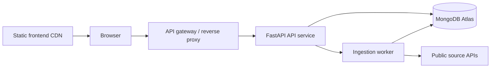

# Deployment

The repository currently implements script-based deployment. Docker, docker-compose, Terraform, Kubernetes manifests, and platform-specific deployment files are not present.

## Local Development

Backend:

```bash
cd geoshop_engine
python -m venv .venv
.venv\Scripts\activate
pip install -r requirements.txt
python run_api.py
```

Frontend:

```bash
cd geoshop_engine/frontend
npm install
npm run dev
```

## Production Build

Frontend:

```bash
cd geoshop_engine/frontend
npm ci
npm run build
```

Backend:

```bash
cd geoshop_engine
pip install -r requirements.txt
uvicorn api.main:app --host 0.0.0.0 --port 8000
```

For production, run Uvicorn under a process manager or container runtime and disable development reload.

## Environment Setup

Required production environment:

- `MONGODB_URL`
- `DATABASE_NAME`
- `APP_HOST`
- `APP_PORT`
- source tuning variables as needed
- frontend `VITE_API_BASE` at build time

## Recommended Cloud Architecture



## Docker Recommendation

Add:

- Backend Dockerfile based on `python:3.11-slim`.
- Frontend Dockerfile or static build deployment.
- `docker-compose.yml` for local MongoDB plus API.
- Healthcheck for `/api/health`.
- Non-root runtime user.

## CI/CD Recommendation

The added GitHub Actions workflow validates Python imports and frontend build. Next steps:

- Add pytest tests after repairing stale SQLAlchemy-era tests.
- Add dependency scanning.
- Add Docker image build.
- Add deployment gates for staging and production.
- Publish release notes from tags.

