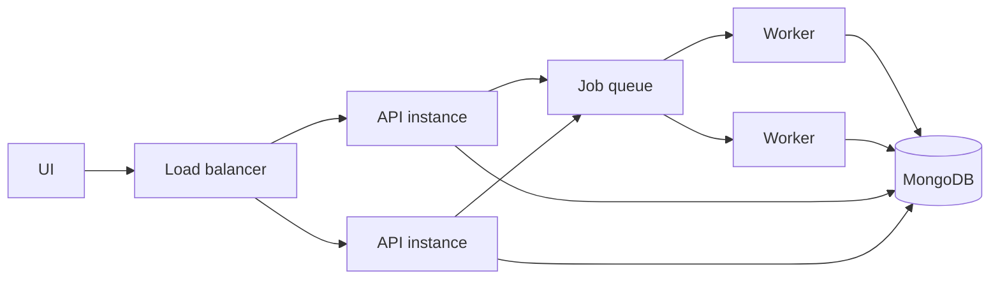

# Scaling Strategy

## Current Scaling Limits

| Area | Current Behavior | Limit |
| --- | --- | --- |
| Matching | Nested loop over all records | O(n²) growth. |
| Progress | Global in-process dict | Not multi-instance safe. |
| Jobs | FastAPI background tasks | Coupled to web process lifecycle. |
| Closure detection | Scans up to 100,000 active shops | Expensive as data grows. |
| Search | Regex and coordinate bounds | Limited relevance and geospatial precision. |

## Recommended Scaling Path

### Phase 1: Make Writes Idempotent

- Add canonical place key.
- Use upsert instead of blind insert.
- Track source-specific external ids where available.

### Phase 2: Improve Matching

- Bucket candidates by geohash or rounded coordinates.
- Use MongoDB `2dsphere` index and `$near` queries.
- Compare text only within spatial candidate buckets.

### Phase 3: Split Workers

- Move sync execution to Celery, RQ, Dramatiq, or managed queues.
- Persist job progress in MongoDB or Redis.
- Keep FastAPI focused on HTTP reads and job submission.

### Phase 4: Add Observability And Controls

- Rate limit sync triggers.
- Add source-specific circuit breakers.
- Record per-stage timings.
- Add alerts for zero-record source runs.

## Multi-Instance Design

