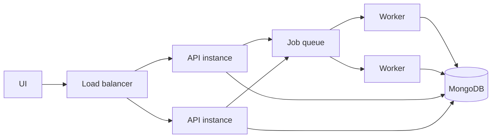

# Scaling Strategy

GeoShop Engine is built around clear boundaries between ingestion, matching, scoring, persistence, API access, and dashboard visibility. Those boundaries make the project a strong foundation for distributed execution and larger datasets.

## Current Scaling Characteristics

| Area | Current Behavior | Architecture Evolution |
| --- | --- | --- |
| Matching | Pairwise comparison across fetched records | Spatial bucketing and geospatial candidate pruning. |
| Progress | Process-local progress dictionary | Shared progress state in MongoDB or Redis. |
| Jobs | FastAPI background tasks | Dedicated worker queue for distributed execution. |
| Closure detection | Active-shop comparison against observed records | Incremental source snapshots and geospatial prefilters. |
| Search | Regex and coordinate bounds | Text indexes and MongoDB geospatial queries. |

## Scaling Path

### Phase 1: Idempotent Writes

- Add canonical place keys.
- Use upsert workflows for repeatable sync runs.
- Track source-specific external identifiers where available.

### Phase 2: Spatial Candidate Pruning

- Bucket candidates by geohash or rounded coordinates.
- Use MongoDB `2dsphere` indexes and `$near` queries.
- Compare text within spatial candidate buckets.

### Phase 3: Distributed Workers

- Move sync execution to Celery, RQ, Dramatiq, or a managed queue.
- Persist job progress in MongoDB or Redis.
- Keep FastAPI focused on HTTP reads and job submission.

### Phase 4: Operational Controls

- Add rate limits for sync triggers.
- Add source-specific circuit breakers.
- Record per-stage timings.
- Add alerting for source-count anomalies.

## Multi-Instance Design

